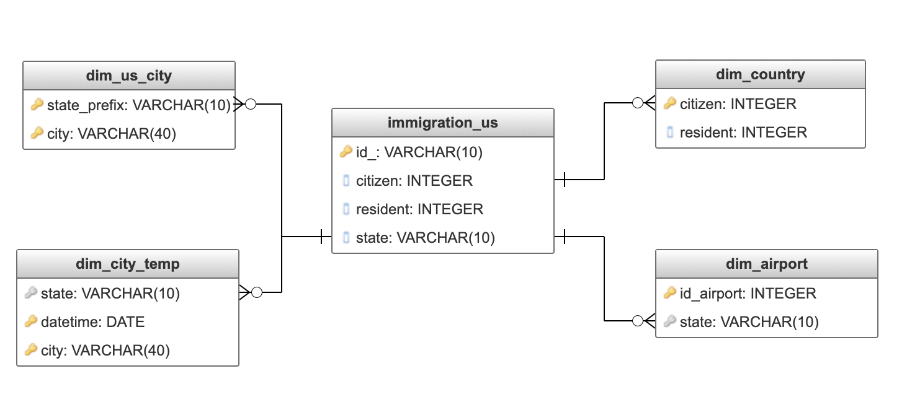

# Data Dictionary

### Dimension Tables:

    - dim_us_city
    - dim_city_temp
    - dim_airport
    - dim_country

### Fact Table:

    - immigration_us

### Database Model

## Description

### dim_us_city
* __id_city__: Serial column, primary key for table
* __city__ (text): Name of the city
* __state__ (text): Name of the State of US without abbreviation
* __male_population__ (integer): Male total population for a city
* __female_population__ (integer): Female total population for a city
* __total_population__ (integer): Male + Female population
* __state_prefix__ (text): Abbreviation of State name, more information [here](https://en.wikipedia.org/wiki/List_of_U.S._state_abbreviations)

### dim_us_weather

* __id_weather__ (integer): Serial, primary key
* __datetime__ (date): Date column in format YYYY-MM-DD  
* __city__ (text): City of US
* __temp__ (float): Average temperature for a City of US. This temperature is grouped by day and city.
* __state_prefix__ (text): Abbreviation of State name, more information [here](https://en.wikipedia.org/wiki/List_of_U.S._state_abbreviations)

### dim_airport

- __id_airport__ (integer): ID code for each airport of US
- __type__ (text): Type of airport, like small airport, large, heliport, etc.
- __name__ (text): Name of the airport
- __country__ (text): Country were the airport is located
- __state__ (text): State were the airport is located
- __city__ (text): City were the airport is located

### dim_country

- __id_country__ (text): ID country, related to us immigration dictionary. This code is related to the column `citizen` and `resident` for every immigrant in the main dataset.
- __country__ (text): Name of the country were the immigrant is a citizen and resident.

### immigration_us

* __id__ (integer): Unique ID for every row in the table.
* __year__ (integer): Year of entry into US.
* __month__ (integer): Month of entry into US.
* __citizen__ (integer): Country code where the immigrant is an official citizen. Join with dim_country
* __resident__ (integer): Country code where the immigrant is an official resident. Join with dim_country
* __port_entry__ (text): Port of entry into US.
* __mode_entry__ (integer): Mode of entry, like air, sea, land, etc.
* __arrival_date__ (date): Date of arrival.
* __dep_date__ (date): Departure date.
* __dateadd_to__ (date): Date to which admitted to U.S. (allowed to stay until).
* __state_addr__ (text): State address where the immigrant will stay. Join with all tables of Datawarehouse.
* __birth_year__ (integer): Year of birth.
* __age__ (integer): Age of immigrant in years.
* __gender__ (text): Immigrant sex.
* __visa_code__ (integer): Visa category code: 1- Business, 2- Pleasure, 3- Student.
* __visa_type__ (text): Class of admission legally admitting the non-immigrant to temporarily stay in U.S
* __airline__ (text): Airline used to arrive in the U.S. If correspond.
